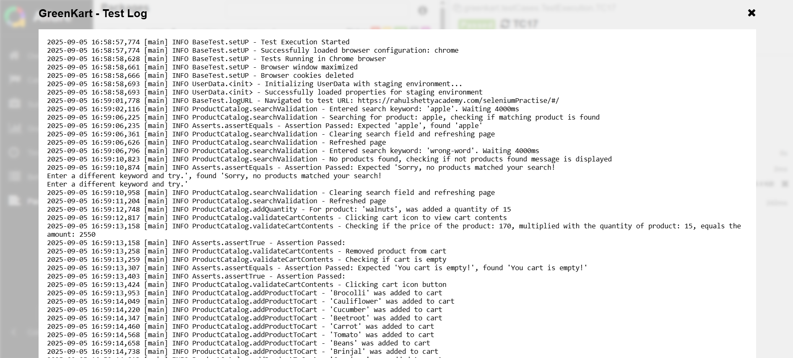

# Selenium Project Overview

This personal project, written in Java, automates 17 key test cases for the GreenKart demo e-commerce website, utilizing Selenium WebDriver for robust browser automation, TestNG for efficient sequential test management, and Allure Report for clear and comprehensive reporting. The framework follows the Page Object Model (POM) design pattern, ensuring clean, scalable, and maintainable test scripts. Managed through Maven (pom.xml), the project simplifies dependency handling and build automation. Additionally, it integrates Log4j for detailed logging and enhances Allure Report with automatic screenshot capture on test failures.

Test execution is organized sequentially, with each test depending on the successful completion of the previous one, ensuring the integrity of the e-commerce workflows. The tests cover critical functionalities like searching for products, adding quantities, validating cart contents, and checking the total item count, offering a complete automated validation of the user experience.

All test cases utilize Allure annotations to improve integration with the Allure report:

* ```@Epic```: Categorizes the test under a high-level feature or functionality.
* ```@Feature```: Specifies the test object class.
* ```@Story```: Describes a specific test case.
* ```@Severity```: Indicates the severity of the test, which helps prioritize the issues in the report.

To run the tests, navigate to project directory and execute the following command:
	```mvn test```, this will trigger Maven to compile the project and run the test cases defined in the project.

* Test Cases execution demo in Chrome:
[](https://www.youtube.com/watch?v=iBN7jS_tjLo)

# Test Cases containing Test Case IDs, Epic, Story, Severity Level, Test Steps, Test Automation Data, Expected Results and Allure Report Status can be found here:
* [Test Cases Spreadsheet Document](https://docs.google.com/spreadsheets/d/1W0hDRaHM6tZHKh8rP9q0Pqd5qYIOr4XIj5_PFjgjEz4/edit?gid=0#gid=0)


## Technologies and Concepts Used

- Selenium WebDriver — Browser automation tool for interacting with web elements
- TestNG — Testing framework used for test execution and management
- Page Object Model — Design pattern to create maintainable and reusable test code
- Maven — Build and dependency management tool
- Log4j2 — Logging framework to capture execution details
- Allure Reports — Test reporting framework for reports


## Project Structure

The project follows Maven’s standard directory layout and is organized into configuration files, page objects, test cases, drivers, logs and resources.

```
├───src
│   ├───main
│   │   └───java
│   │       └───greenkart
│   │           ├───config (BaseTest.java, UserData.java, Waits.java, Asserts.java, ElementActions.java, browser.properties, production.properties, staging.properties)
│   │           └───pageObject (CheckoutPage.java, OrderSubmissionPage.java, ProductCatalog.java, TopDeals.java)
│   └───test
│       └───java
│           └───greenkart
│               └───testCases (TestExecution.java)
├───resources (log4j2.xml)
├───drivers (chromedriver, geckodriver, msedgedriver)
├───logs (test-run.log)
README.md
pom.xml
testng.xml
```


## \selenium-project2\src\main\java\greenkart\pageObject
This directory contains the page object classes representing various pages of the application. These classes encapsulate the logic for interacting with page elements and provide methods to perform actions.

* ```ProductCatalog.java```: Contains methods and locators for interacting with the product catalog.

* ```CheckoutPage.java```: Includes methods and locators for handling the checkout process.

* ```OrderSubmissionPage.java```: Contains methods and locators for interacting with the order submission page.

* ```TopDeals.java```: Includes methods and locators for managing interactions on the top deals page.

## \selenium-project2\src\main\java\greenkart\config
This directory contains configuration files and base test classes needed for setting up the testing environment.

* ```BaseTest.java```: A base test class that initializes the WebDriver and provides common test setup and teardown methods.
	
* ```UserData.java```: Loads environment-specific configuration properties (such as staging or production) from the staging.properties or production.properties files during initialization. It provides access to these properties, such as retrieving the configured URL, while logging the process for traceability and error handling.

* ```Asserts.java```: Wraps TestNG assertions with Log4j logging for clearer test result reporting. It supports multiple data types and custom messages for better debugging.

* ```Waits.java```: Wait methods using Selenium’s WebDriverWait and FluentWait to handle dynamic web elements during test execution. It logs wait outcomes and handles exceptions for improved test stability and easier debugging.

* ```ElementActions.java```: Provides utility methods for interacting with web elements using standard Selenium actions and JavascriptExecutor. It includes dropdown selection, scrolling and retrieving element text with logging and error handling.

* ```browser.properties```: A properties file where you can select the browser in which the test cases will run (chrome, firefox or edge). Test execution can also be set to run headless, to run in headless mode, append ```headless``` to chrome, firefox or edge.

* ```staging.properties```: A properties file where you can select the staging URL.

* ```production.properties```: A properties file where you can select the production URL.

## \selenium-project2\src\test\java\greenkart\testCases
This directory contains the test case classes responsible for executing the test logic. Each class corresponds to specific scenarios and uses the page objects to carry out the tests.

* ```TestExecution.java```: The main class that contains the execution logic for running the tests. It integrates the page objects and performs actions in sequence to test the application.

## Logging and Reporting
Logging is handled using Log4j, with log output saved in the resources folder as configured in ```log4j.properties```.
The logs folder contains ```test-run.log```, which stores all execution logs generated during test runs.
test reports are generated using Allure.

To generate and open the Allure report: ```allure serve```

To generate a standalone HTML report: ```allure generate --clean -o allure-report```, then open ```allure-report/index.html``` in a browser.

Test execution logs are also displayed in Allure under ```testRunLog``` -> ```GreenKart - Test Log``` for each test. In case of failed tests, screenshots will be attached under ```afterTest``` -> ```Failed Test Screenshot```.


