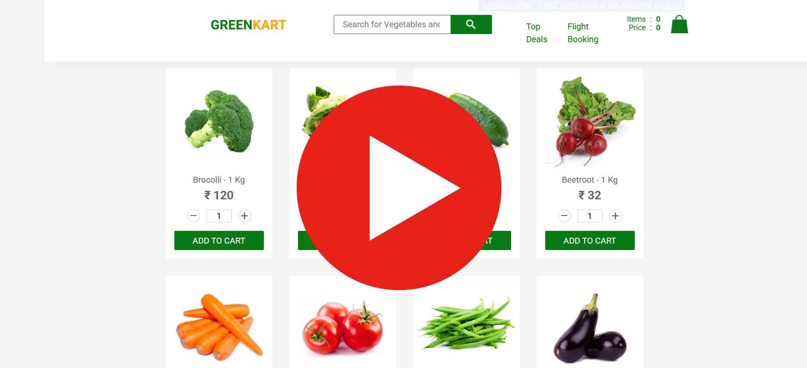
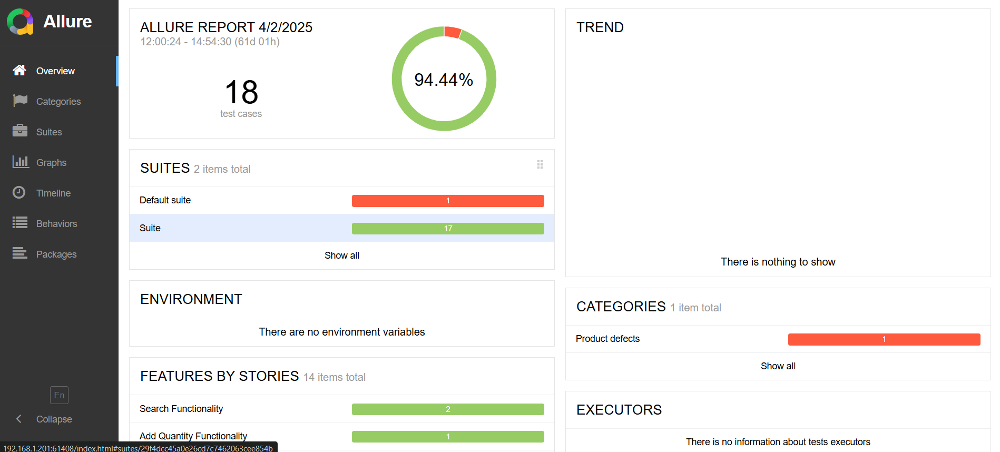
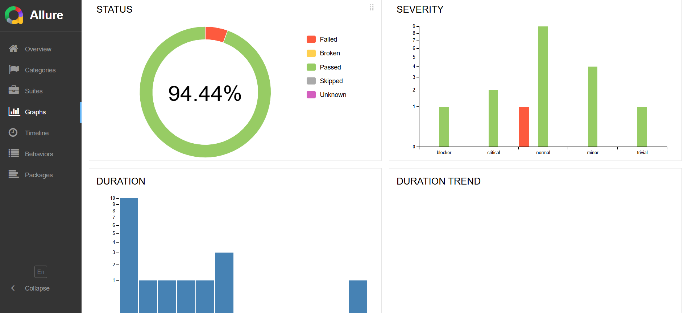
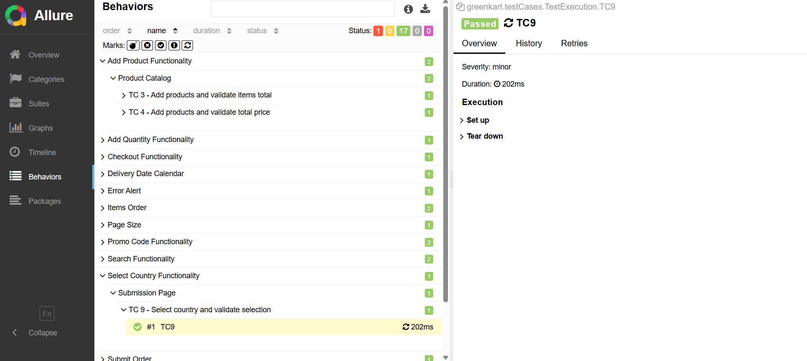
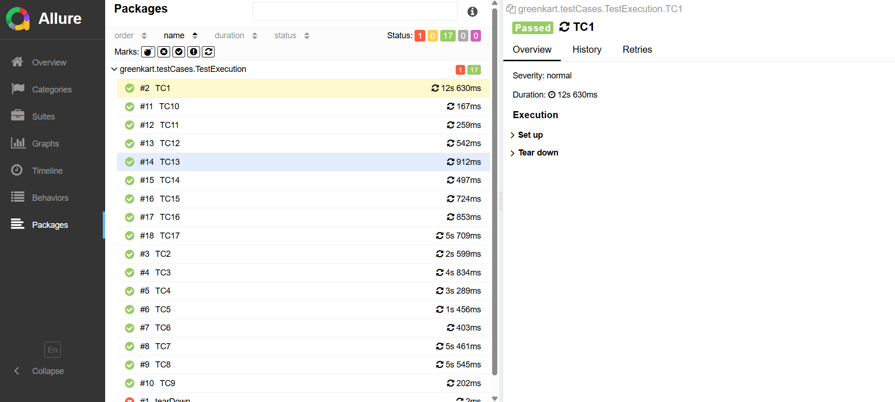
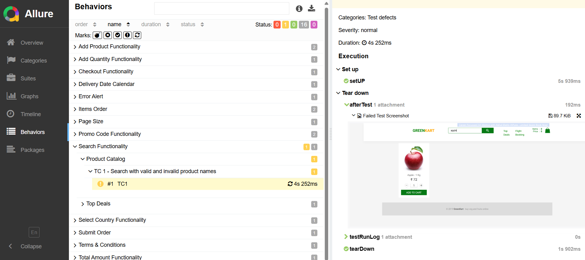
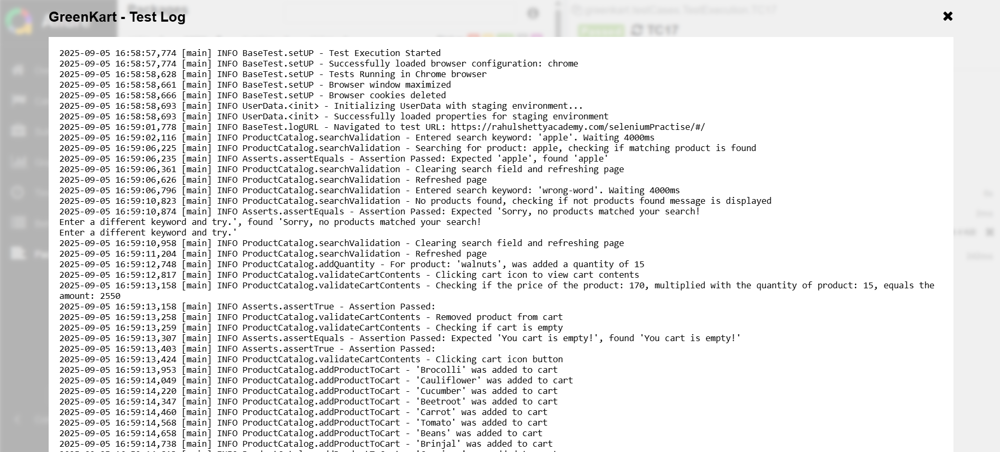

# Selenium Project Overview

This personal project, written in Java, automates 17 key test cases for the GreenKart demo e-commerce website, utilizing Selenium WebDriver for robust browser automation, TestNG for efficient sequential test management, and Allure Report for clear and comprehensive reporting. The framework follows the Page Object Model (POM) design pattern, ensuring clean, scalable, and maintainable test scripts. Managed through Maven (pom.xml), the project simplifies dependency handling and build automation. Additionally, it integrates Log4j for detailed logging and enhances Allure Report with automatic screenshot capture on test failures.

Test execution is organized sequentially, with each test depending on the successful completion of the previous one, ensuring the integrity of the e-commerce workflows. The tests cover critical functionalities like searching for products, adding quantities, validating cart contents, and checking the total item count, offering a complete automated validation of the user experience.

All test cases utilize Allure annotations to improve integration with the Allure report:

* ```@Epic```: Categorizes the test under a high-level feature or functionality.
* ```@Feature```: Specifies the test object class.
* ```@Story```: Describes a specific test case.
* ```@Severity```: Indicates the severity of the test, which helps prioritize the issues in the report.

To run the tests, navigate to project directory and execute the following command:
	```mvn test```, this will trigger Maven to compile the project and run the test cases defined in the project.

* Test Cases execution demo in Chrome:
[](https://www.youtube.com/watch?v=iBN7jS_tjLo)

# Test Cases containing Test Case IDs, Epic, Story, Severity Level, Test Steps, Test Automation Data, Expected Results and Allure Report Status can be found here:
* [Test Cases Spreadsheet Document](https://docs.google.com/spreadsheets/d/1W0hDRaHM6tZHKh8rP9q0Pqd5qYIOr4XIj5_PFjgjEz4/edit?gid=0#gid=0)

## \selenium-project2\src\main\java\greenkart\pageObject
This directory contains the page object classes representing various pages of the application. These classes encapsulate the logic for interacting with page elements and provide methods to perform actions.

* ```ProductCatalog.java```: Contains methods and locators for interacting with the product catalog.

* ```CheckoutPage.java```: Includes methods and locators for handling the checkout process.

* ```OrderSubmissionPage.java```: Contains methods and locators for interacting with the order submission page.

* ```TopDeals.java```: Includes methods and locators for managing interactions on the top deals page.

## \selenium-project2\src\main\java\greenkart\config
This directory contains configuration files and base test classes needed for setting up the testing environment.

* ```BaseTest.java```: A base test class that initializes the WebDriver and provides common test setup and teardown methods.
	
* ```browser.properties```: A properties file where you can select the browser in which the test cases will run (chrome, firefox or edge). Test execution can also be set to run headless, to run in headless mode, append ```headless``` to chrome, firefox or edge.

## \selenium-project2\src\test\java\greenkart\testCases
This directory contains the test case classes responsible for executing the test logic. Each class corresponds to specific scenarios and uses the page objects to carry out the tests.

* ```TestExecution.java```: The main class that contains the execution logic for running the tests. It integrates the page objects and performs actions in sequence to test the application.

## Allure Report
Every test step is logged using Log4j, including whether a test passes or fails, and a screenshot is captured on failure, all of which are included in the Allure report.
To generate and open the .html allure report, navigate to project directory and execute the following command:
	```allure serve```






