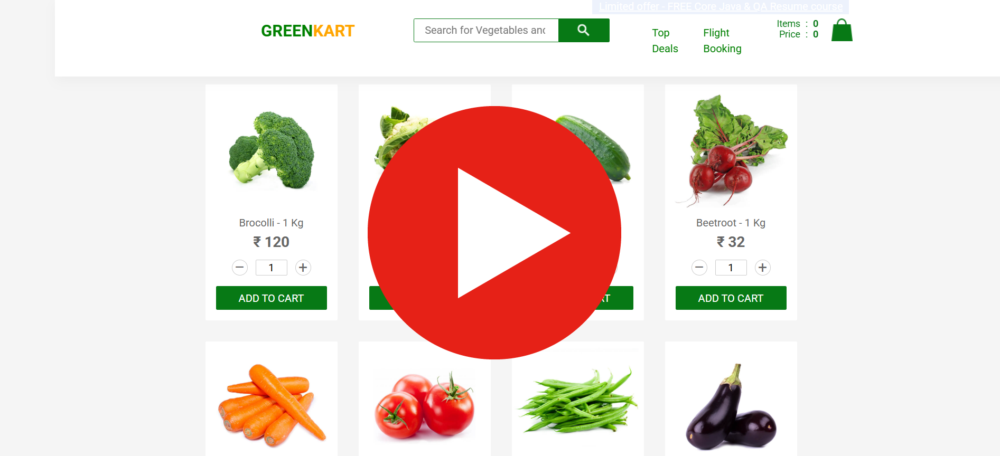
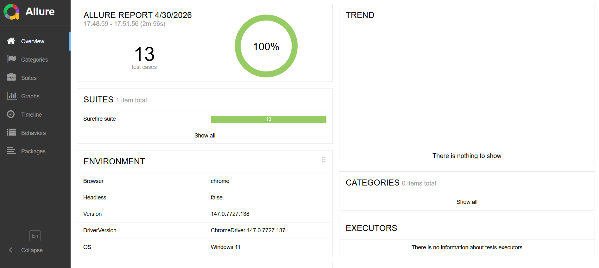
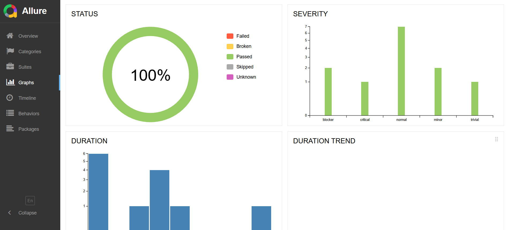
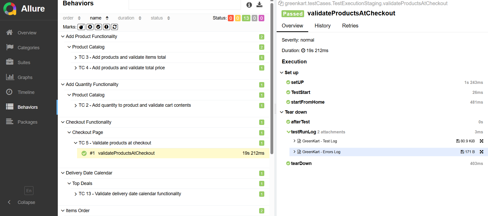
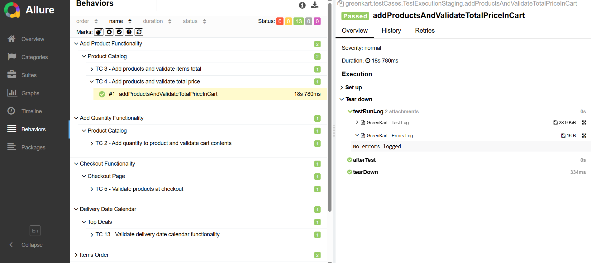
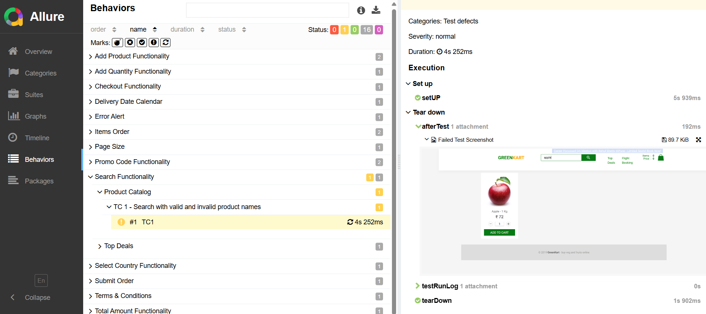
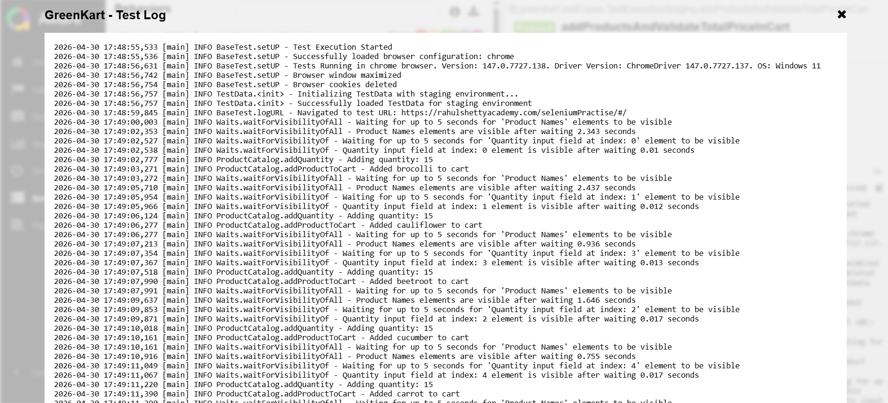

# Selenium Project Overview

This personal project, written in Java, automates 13 key **independent test cases** for the GreenKart demo e-commerce website, utilizing Selenium WebDriver for robust browser automation, TestNG for efficient sequential test management and Allure Report for clear and comprehensive reporting. The framework follows the Page Object Model (POM) design pattern, ensuring clean, scalable, and maintainable test scripts. Managed through Maven (pom.xml), the project simplifies dependency handling and build automation. Additionally, it integrates Log4j for detailed logging and enhances Allure Report with automatic screenshot capture on test failures.

Tests cover critical functionalities like searching for products, adding quantities, validating cart contents and checking the total item count, offering a complete automated validation of the user experience.

All test cases utilize Allure annotations to improve integration with the Allure report:

* ```@Epic```: Categorizes the test under a high-level feature or functionality.
* ```@Feature```: Specifies the test object class.
* ```@Story```: Describes a specific test case.
* ```@Severity```: Indicates the severity of the test, which helps prioritize the issues in the report.

## Start test execution
Tests can be started using Maven commands specifying the test class to execute. 

To run staging tests:
- ```mvn test -Dtest=TestExecutionStaging```

To run production tests:
- ```mvn test -Dtest=TestExecutionProduction```

The browser in which the test cases will run (chrome, firefox or edge) can be set from the ```browser.properties``` file. 
To run in headless mode, append ```headless``` to chrome, firefox or edge.

* Test Cases execution demo in Chrome:
[](https://youtu.be/gDUpJ_CB6DU)

## Automation Coverage Table

The table below provides an overview of the automation design:

- Epic – the main area of the application under test
- Story – the specific functionality being validated within the feature
- Severity Level - the impact level of the test (e.g. blocker, critical, normal, minor)
- Test Steps – the sequence of actions and validations performed during the test
- Test Automation Data – primary automation method that implements the test (some helper methods are excluded)
- Expected Results - the expected outcome after executing the test steps
- Allure Report Status - the final execution status in Allure

This table serves as a quick reference to understand what is automated, how it is structured and what parameters are needed to execute each test:

* [Automation Tests Document](https://docs.google.com/spreadsheets/d/1W0hDRaHM6tZHKh8rP9q0Pqd5qYIOr4XIj5_PFjgjEz4/edit?gid=0#gid=0)


## Technologies and Concepts Used

- Selenium WebDriver — Browser automation tool for interacting with web elements
- TestNG — Testing framework used for test execution and management
- Page Object Model — Design pattern to create maintainable and reusable test code
- Maven — Build and dependency management tool
- Log4j2 — Logging framework to capture execution details
- Allure Reports — Test reporting framework for reports


## Project Structure

The project follows Maven's standard directory layout and is organized into configuration files, page objects, test cases, drivers, logs and resources.

```
├───src
│   ├───main
│   │   └───java
│   │       └───greenkart
│   │           ├───config (Asserts.java, BaseTest.java, ElementActions.java, Retry.java, TestData.java, Waits.java, browser.properties, production.properties, staging.properties)
│   │           └───pageObject (CheckoutPage.java, OrderSubmissionPage.java, ProductCatalog.java, TopDeals.java)
│   └───test
│       └───java
│           └───greenkart
│               └───testCases (TestExecution.java)
├───resources (log4j2.xml)
├───drivers (chromedriver, geckodriver, msedgedriver)
├───logs (test-run.log, error-summary.log)
README.md
pom.xml
testng-staging.xml
testng-production.xml

```


## \selenium-project2\src\main\java\greenkart\pageObject
This directory contains the page object classes representing various pages of the application. These classes encapsulate the logic for interacting with page elements and provide methods to perform actions.

* ```ProductCatalog.java```: Contains methods and locators for interacting with the product catalog.

* ```CheckoutPage.java```: Includes methods and locators for handling the checkout process.

* ```OrderSubmissionPage.java```: Contains methods and locators for interacting with the order submission page.

* ```TopDeals.java```: Includes methods and locators for managing interactions on the top deals page.

## \selenium-project2\src\main\java\greenkart\config
This directory contains configuration files and base test classes needed for setting up the testing environment.

* ```BaseTest.java```: A base test class that initializes the WebDriver and provides test setup and teardown methods.
	
* ```TestData.java```: Handles loading environment-specific test data from staging.properties or production.properties. 

Features: 
- ```getUrl()```		Returns the base URL
- ```getProducts()```		Returns a list of products (comma-separated)
- ```getProduct()```		Returns a single product
- ```getKeyword()```		Returns search keyword
- ```getQuantity()```		Returns product quantity
- ```getDiscountCode()```	Returns discount code
- ```getCountry()```		Returns country name
- ```getPageSize()```		Returns pagination size
- ```getMonthYear()```		Returns month and year for date selection
- ```getDay()```		Returns day value

Supported Properties in staging.properties / production.properties: url, products, product, keyword, quantity, discountCode, country, pageSize, monthYear, day

* ```Asserts.java```: Wraps TestNG assertions with Log4j logging for clearer test result reporting. It supports multiple data types and custom messages for better debugging.

* ```Waits.java```: Wait methods using Selenium’s WebDriverWait and FluentWait to handle dynamic web elements during test execution. It logs wait outcomes and handles exceptions for improved test stability and easier debugging.

* ```ElementActions.java```: Provides utility methods for interacting with web elements using standard Selenium actions and JavascriptExecutor. It includes dropdown selection, scrolling and retrieving element text with logging and error handling.

* ```Retry.java```: Implements TestNG's retry mechanism by re-running failed tests a limited number of times. It logs each retry attempt and stops execution after the maximum retry count is reached.

* ```browser.properties```: A properties file where you can select the browser in which the test cases will run (chrome, firefox or edge). Test execution can also be set to run headless, to run in headless mode, append ```headless``` to chrome, firefox or edge.

## \selenium-project2\src\test\java\greenkart\testCases
This directory contains the test case classes responsible for executing the test logic. Each class corresponds to specific scenarios and uses the page objects to carry out the tests.

* ```TestExecution.java```: The main class that contains the execution logic for running the tests. It integrates the page objects and performs actions in sequence to test the application.

## Logging and Reporting
Logging is handled using Log4j2, with log output saved in the logs folder as configured in ```log4j2.xml``` file from the resources folder.
The logs folder contains 2 log files:
- ```test-run.log``` which stores all execution logs generated during test runs. 
- ```error-summary.log``` which stores only the errors logged during test runs.

To generate and open the Allure report: ```allure serve```

To generate a standalone HTML report: ```allure generate --clean -o allure-report```, then open ```allure-report/index.html``` in a browser.

Test execution logs are also displayed in Allure under ```testRunLog``` -> ```GreenKart - Test Log``` for each test. In case of failed tests, screenshots will be attached under ```afterTest``` -> ```Failed Test Screenshot```.






